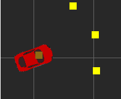

# Applying Evolutionary Artificial Neural Networks using Python

A 2D Unity simulation in which cars learn to navigate themselves through different courses. The cars are steered by a feedforward Neural Network. The weights of the network are trained using a modified genetic algorithm.
There is brief presentation on the Youtube. !!!link do youtube'a!!! 
It is highly recommended to watch this before further reading.

## The Simulation

Cars have to navigate through a course without touching the walls or any other obstacles of the course. A car has three front-facing sensors which measure the distance to obstacles in a given direction. The readings of these sensors serve as the input of the car's neural network. Each sensor points into a different direction, covering a front facing range of approximately 70 degrees. The output of the Neural Network then determines the car’s current turning force.

The main difficulty of all project was to build simulation environment. The first idea was to use [pygame](https://github.com/pygame/) library. Unfortunately, during the implementation it turned out that this library is not sufficient for this purpose. Consequently I wrote my own geometry library, which use pygame in a few places. Newly implemented properties that we can use from now on are:
- findind collision between rotated rectangles (pygame allows only non-rotatable rectangles to do that action)
- finding projection of ray on other objects.

These issues are better explained in video, whose link is at the beginning of this article.
You can check code of mentioned library by reading "geometry.py" file located at [Modules/Simulation/](Modules/Simulation/)
There are also modules which contains classes necessary to build objects, which together create the environment (cars and map).

## The Neural Network

The Neural Network used is a standard, fully connected, feedforward Neural Network. It comprises 4 layers: an input layer with 3 neurons, two hidden layers with 4 and 3 neurons respectively and an output layer with 3 neurons.
The core of neural network is model adopted from [Keras](https://github.com/keras-team/keras) library
The code for the Neural Network can be found at [Modules/AI/NeuralNetworks/](Modules/AI/NeuralNetworks/).

## Training the Neural Network

The weights of the Neural Network are trained using an Evolutionary Algorithm known as the Genetic Algorithm.

At first there are N randomly initialised cars spawned. The best cars are then selected to be recombined with each other, creating new "offspring" cars. These offspring cars then form a new population of N cars and are 
also slightly mutated in order to inject some more diversity into the population. The newly created population of cars then tries to navigate the course again and the process of evaluation, selection, recombination and mutation starts again. One complete cycle from the evaluation of one population to the evaluation of the next is called a generation.

Methods listed above (evaluation, selection and recombination) are adopted from [DEAP](https://github.com/DEAP). The same with tools necessary to build data structures used in algorithm.
The entire code related with algorithm can be found at [Modules/AI/Genetics/](Modules/AI/Genetics/). The operation of this class can be modified  by changing parameters in the "settings.py" module located at [Modules/Settings/](Modules/Settings/) (methods are also considered as parameters). You can choose method from DEAP library (by default) or create your own.

## User Interface

User interface uses pygame library. 
In the upper right corner a generation counter is displayed.
The entire UI-code is located at [Modules/GUI/](Modules/GUI/).

## How to use

If you would like to tinker with the parameters of the simulation, you can do so in the "settings.py" module located at [Modules/Settings/](Modules/Settings/). If you would simply like to run the simulation with default parameters, you can run [Scripts/perform_experiments.py](Scripts/perform_experiments.py) script. To show the results you can run [Scripts/show_single_album.py](Scripts/show_single_album.py) script.

## License

Feel free to use my code in your personal projects. I would be very interested in any work that originates from this project. I would be more than happy to hear from your impressions and results, so feel free to mail me at pawel.brysch@gmail.com.
